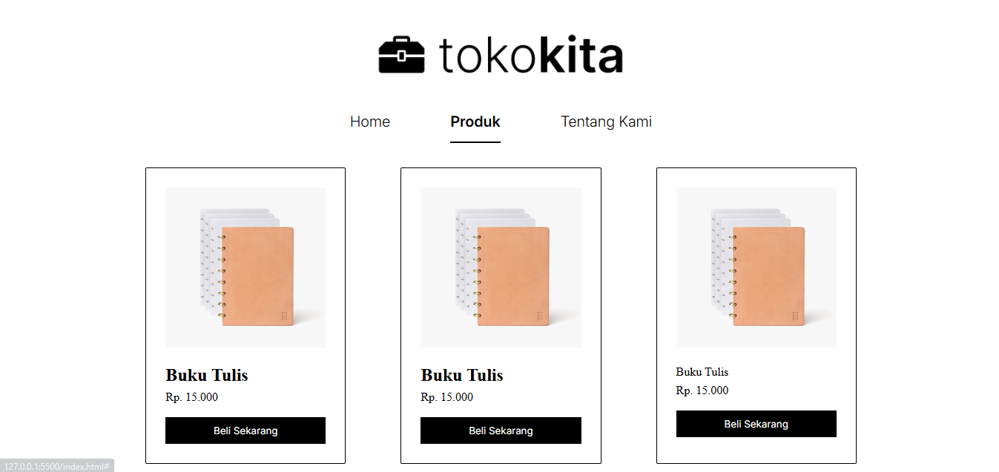

# Assignment: CSS Product Page

This is a simple static webpage built as part of a web development class/bootcamp assignment.  
The focus of this assignment is practicing HTML and CSS fundamentals.

## 📝 Features

- Logo and navigation bar
- Product list section with 3 products displayed
- Responsive layout
- Clean and semantic HTML structure

## 📸 Screenshot

